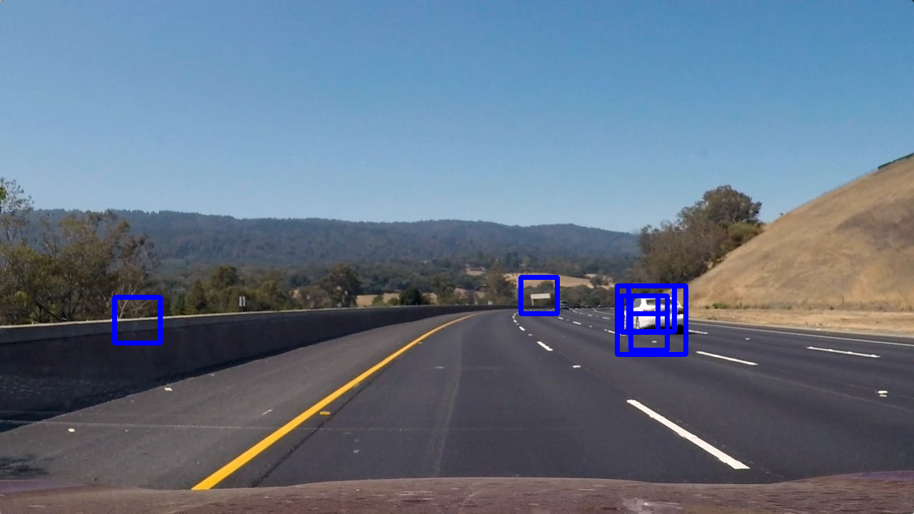
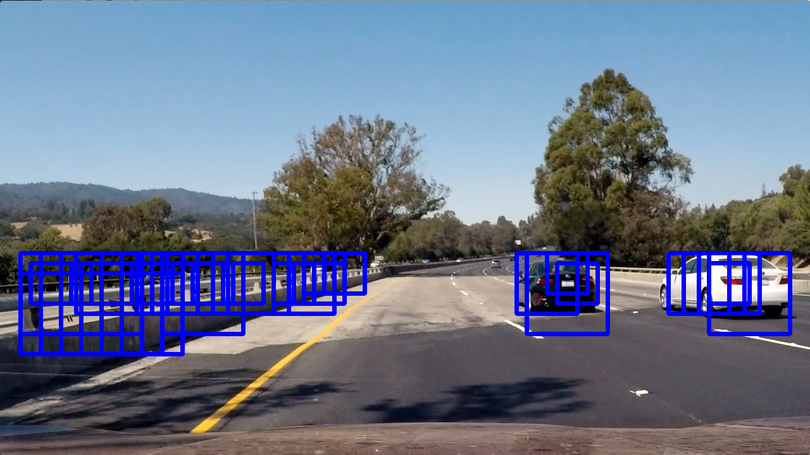

# Vehicle Detection

Overview
---
In this project, your goal is to write a software pipeline to detect vehicles in a video (start with the test_video.mp4 and later implement on full project_video.mp4), but the main output or product we want you to create is a detailed writeup of the project.  


The Project
---

The goals / steps of this project are the following:

* Perform a Histogram of Oriented Gradients (HOG) feature extraction on a labeled training set of images and train a classifier Linear SVM classifier
* Optionally, you can also apply a color transform and append binned color features, as well as histograms of color, to your HOG feature vector. 
* Note: for those first two steps don't forget to normalize your features and randomize a selection for training and testing.
* Implement a sliding-window technique and use your trained classifier to search for vehicles in images.
* Run your pipeline on a video stream (start with the test_video.mp4 and later implement on full project_video.mp4) and create a heat map of recurring detections frame by frame to reject outliers and follow detected vehicles.
* Estimate a bounding box for vehicles detected.

Here are links to the labeled data for [vehicle](https://s3.amazonaws.com/udacity-sdc/Vehicle_Tracking/vehicles.zip) and [non-vehicle](https://s3.amazonaws.com/udacity-sdc/Vehicle_Tracking/non-vehicles.zip) examples to train your classifier.  These example images come from a combination of the [GTI vehicle image database](http://www.gti.ssr.upm.es/data/Vehicle_database.html), the [KITTI vision benchmark suite](http://www.cvlibs.net/datasets/kitti/), and examples extracted from the project video itself.   You are welcome and encouraged to take advantage of the recently released [Udacity labeled dataset](https://github.com/udacity/self-driving-car/tree/master/annotations) to augment your training data.  

### Setup

To test the output of this project, you can just call:

```sh
python main.py
``` 

The training will take some minutes and afterwards the pipeline applied to test_images should be displayed.

### Dependencies
This repo requires:

* [CarND Term1 Starter Kit](https://github.com/udacity/CarND-Term1-Starter-Kit)

The lab enviroment can be created with CarND Term1 Starter Kit. Click [here](https://github.com/udacity/CarND-Term1-Starter-Kit/blob/master/README.md) for the details.

---

Writeup
---

**Vehicle Detection Project**

---

### Histogram of Oriented Gradients (HOG)

#### 1. Explain how (and identify where in your code) you extracted HOG features from the training images.

I started by reading in all the `vehicle` and `non-vehicle` images. After that, a HOG feature extraction is performed on every single image.

The HOG features are extracted through the get_hog_features in the framework.py:26.

The HOG calculation follows the one from the lesson, but the parameters needs to be tuned for this use case.

The parameters for the HOG feature extraction are selected through the performance of the classifier.

So, first the how feature extraction and fitting process was implemented to see on which form of features the classifier performs best.

#### 2. Explain how you settled on your final choice of HOG parameters.

I tried various combinations of parameters for colorspace, orientation, pix_per_cell, cell_per_block and ended up with the following:
* cspace = 'YCrCb'
* orient = 8
* pix_per_cell = 8
* cell_per_block = 2
* hog_channel = 'ALL'

The classifier performed on these the best.

A including binned color features and/or color histogram decreased the performance.

#### 3. Describe how (and identify where in your code) you trained a classifier using your selected HOG features (and color features if you used them).

Based on the provided input data (vehicles and non_vehicles), feature extraction is performed through the HOG feature extraction (see above).

After that, the classifier is fed with the training data (extracted training data). 

For the classifier, a SVM with a Linear SVC is chosen. Also other classifier were tested (DecisionTree, RandomForest), but without big tuning the SVC performed the best.

Due to the fact that at the end of the pipeline, False positives are distracting, another performance measurement is introduced:
The F1 Score combines recall and precision and gives therefore more information about the false positive rate than an trivial accuracy score. 


### Sliding Window Search

#### 1. Describe how (and identify where in your code) you implemented a sliding window search.  How did you decide what scales to search and how much to overlap windows?

The sliding window search from the lesson was too slow. That's why an optimized algorithm with nearly the same functionality was implemented.

The algorithm can be found in the find_car.py:154 (find_cars function).

In this algorithm a sliding window with a defined scale start from a certain y position and ends at a certain y position.

In the pipeline function(find_car.py:123) a list of these pairs can be found.

So, for optimizing the sliding window algorithm this list of pairs needs to be tuned. 

Here is an example with this subsampling approach:



Because of the scale 0.8 window even the car that is very far away is detected.

#### 2. Show some examples of test images to demonstrate how your pipeline is working.  What did you do to optimize the performance of your classifier?

As mentioned above, each image will be sampled with sliding windows of different sizes, then the output looks like that:



To filter the false positives out, a heatmap is now applyed with a certain threshold to the given sliding window image.

This is possible because some positions are sampled frequently (also due to overlay). So only the places where a car is found more than once are taken into account.  

This will look like this:


Based on the calculated heatmap, again bounding boxes will be drawn, which will look like that:


Here, you can see that two vehilces close to the ego vehicle are clearly detected, but the vehicles in far distance are filtered out.
Moreover, the vehicles on the against roadway are detected.

---

### Video Implementation

#### 1. Provide a link to your final video output.  Your pipeline should perform reasonably well on the entire project video (somewhat wobbly or unstable bounding boxes are ok as long as you are identifying the vehicles most of the time with minimal false positives.)
Here's a [link to my video result](doc/project_video_out.mp4)


#### 2. Describe how (and identify where in your code) you implemented some kind of filter for false positives and some method for combining overlapping bounding boxes.

As shown above, a heatmap is implemented to filter out the false positives and moreover filter over the video is implemented.

This filter is not only including the current calculated rectangles (found cars), but also the one from previous images (assuming that the cars are driving slowly ;) ).

So, the heatmap calculation looks also on the history of the rectangles. 

---

### Discussion

#### 1. Briefly discuss any problems / issues you faced in your implementation of this project.  Where will your pipeline likely fail?  What could you do to make it more robust?

The heatmap calculation that filter over the last three frames has optimized the performance biggly!

But nevertheless, the pipeline is not very robust when images with a lot to interpret comes into the image (trees).

Furthermore, maybe some more preprocessing could improve the classifier further.

In spite of everything, in my opinion a Deep Learning approach would probably boost the performance.

Maybe a cloning behaviour deep learning approach with cars could replace the advanced line finding and vehicle detection projects together.